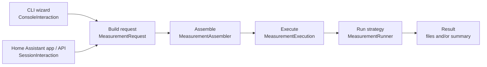

# Measurement tool architecture

The measurement tool has two frontends, but only one measurement pipeline. The CLI and Home Assistant app collect input differently and provide different interaction adapters; after they have built a `MeasurementRequest`, both use the same core.

## The shared pipeline

1. **Frontend and interaction**
   The CLI uses questions, terminal output, and `ConsoleInteraction`. The Home Assistant app uses FastAPI, session events, and `SessionInteraction`. The app also adds preflight, persistence, cancellation, and resume around the shared pipeline.

2. **Build request**
   Both frontends produce the same typed `MeasurementRequest` from `measure/request.py`. It contains the measurement type, profile metadata, parameters, and serializable controller and power-meter specifications.

3. **Assemble**
   `MeasurementAssembler` turns those specifications into live runtime objects: the selected runner, device controller, power meter, and shared measurement utility. It returns a `PreparedMeasurement`.

4. **Execute**
   `MeasurementExecution` owns the common lifecycle. It creates the output directory when needed, invokes the runner, always performs cleanup, measures standby power, and generates `model.json` when requested.

5. **Runner**
   A `MeasurementRunner` contains the measurement-specific strategy for a light, speaker, fan, charging device, average reading, or recorder session. It controls the device, samples power, reports progress through the interaction adapter, and writes strategy-specific files.

6. **Result**
   The runner returns `RunnerResult` with model data, voltage samples, and an optional summary. The CLI exposes generated files in its export directory. The app stores the session result and makes files and summary data available to the UI.

## Main boundary

Everything after `MeasurementRequest` is frontend-independent. CLI or FastAPI concerns should not enter the assembler, executor, or runners. User interaction and progress always pass through `RunInteraction`, which is implemented by the two frontend-specific interaction adapters.
