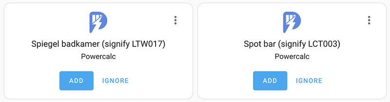

# Quick Start

## Installation

You could either install with HACS (recommended) or manual.

=== "HACS (recommended)"

    This integration is part of the default HACS_ repository. Just click `Explore and add repository` and search for `powercalc` to install, or use this link to go directly there:

    [](https://my.home-assistant.io/redirect/hacs_repository/?owner=bramstroker&repository=homeassistant-powercalc&category=integration)

=== "Manual"

    Copy `custom_components/powercalc` into your Home Assistant `config` directory.

**Post installation steps**

1. Add the following entry to `configuration.yaml`:

    ```yaml
    powercalc:
    ```

2. Restart HA

## Set up power sensors

Powercalc has a built-in library of more than 400 power profiles. Currently, this exists mostly of lights.
These profiles have been measured and provided by users. See [supported models](https://library.powercalc.nl) for the listing of supported devices.

Powercalc scans your HA instance for entities which are supported for automatic configuration. It does that based on the manufacturer and model information known in HA.
After following the installation steps above and restarting HA power (W) and energy sensors (kWh) should appear and you can add them to your installation by clicking `CONFIGURE`, as displayed in the screenshot below



When this is not the case please check the logs for any errors, you can also enable [Debug logging](troubleshooting/debug-logging.md) to get more details about the discovery routine.

When your appliance is not supported out of the box (or you want to have more control) you have extensive options for manual configuration. Please proceed to [Sensor types](sensor-types/index.md) for further instructions.

!!! tip

    When you don't want powercalc to automatically discover sensors in your installation you can disable that behaviour to get full manual control:

    ```yaml
    powercalc:
        enable_autodiscovery: false
    ```

Refer to [global configuration](configuration/global-configuration.md) for all settings you can do on global level.

## Energy dashboard

If you want to use the virtual power sensors in the energy dashboard you'll need an energy sensor. Powercalc automatically creates one for every virtual power sensor. No need for any custom configuration.
These energy sensors then can be selected in the energy dashboard under `Invididual devices`.

You can disable the automatic creation of energy sensors with the option `create_energy_sensors` in your configuration (see [global configuration](configuration/global-configuration.md)).

!!! note

    It can take some time for the energy sensors to appear in the energy dashboard, sometimes more than an hour. Just have a little patience ;-)

[hacs]: https://hacs.xyz/
