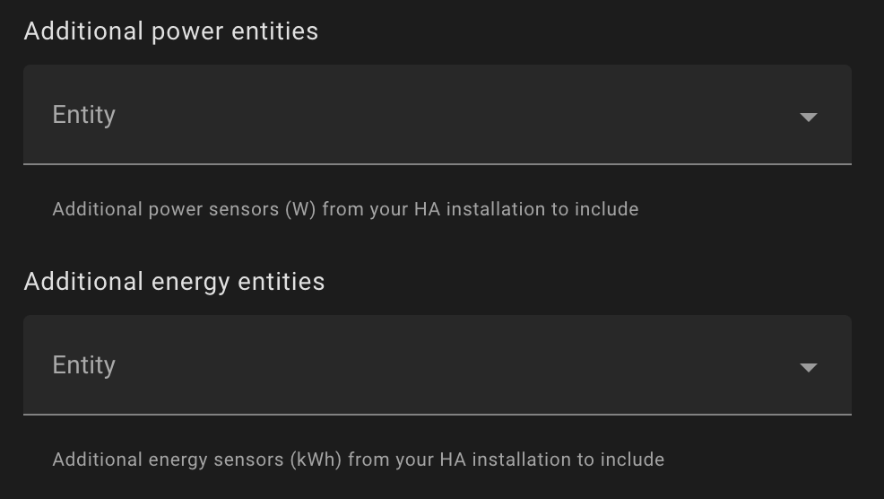

# Custom group

Create a group with a custom name and add individual power and energy sensors to it.

## Create group with GUI

You can create a new group with the GUI using this button.

[](https://my.home-assistant.io/redirect/config_flow_start/?domain=powercalc)

When this is not working.

- Go to `Settings` -> `Devices & Services`
- Click `Add integration`
- Search and click `Powercalc`

Select `Group` -> `Custom` and follow the instructions.

!!! tip

    After you have created a group you can directly assign a virtual power sensor to it when creating the power sensor by selecting the group in the `Group` field.
    You can also create group directly from the power sensor creation page, by filling in a custom group name in the `Group` field.

!!! warning

    Currently sensors registering negative energy values are not supported in groups.

## Create group with YAML

You can combine the `entities` option and `create_group` to group individual power sensors into a group.

```yaml
powercalc:
  sensors:
    - create_group: All hallway lights
      entities:
        - entity_id: light.hallway
        - entity_id: light.living_room
          linear:
            min_power: 0.5
            max_power: 8
```

This will create the following entities:

- sensor.hallway_power
- sensor.hallway_energy
- sensor.living_room_power
- sensor.living_room_energy
- sensor.all_hallway_lights_power (group sensor)
- sensor.all_hallway_lights_energy (group sensor)

### Nesting groups

You can also nest groups, this makes it possible to add an entity to multiple groups.

```yaml
powercalc:
  sensors:
    - create_group: All lights
      entities:
        - entity_id: light.a
        - entity_id: light.b
        - create_group: Upstairs lights
          entities:
            - entity_id: light.c
            - create_group: Bedroom Bob lights
              entities:
                - entity_id: light.d
```

Each group will have power sensors created for the following lights:

- All lights: `light.a`, `light.b`, `light.c`, `light.d`
- Upstairs lights: `light.c`, `light.d`
- Bedroom Bob lights: `light.d`

!!! warning

    a maximum nesting level of 5 groups is allowed!

## Hide individual sensors

To hide individual power sensors, and only have the group sensor available in HA GUI you can use the `hide_members` option.
When you used the GUI to create the group sensor you can use the `Hide members` toggle.

## Adding non powercalc sensors

Sometimes you want to add some power and energy sensors to your group which already exist in your HA installation.
For example some Zwave/Zigbee plug with built-in power monitoring.

In YAML you can use the `power_sensor_id` and `energy_sensor_id` options for that.
Let's assume your smart plug provides `sensor.heater_power` and `sensor.heater_kwh`. We want to add these to the group `Living Room`.

You can use the following configuration:

```yaml
powercalc:
  sensors:
    - create_group: Living Room
      entities:
        - power_sensor_id: sensor.heater_power
          energy_sensor_id: sensor.heater_kwh
        - entity_id: light.hallway #Powercalc sensor
```

!!! note

    When you don't supply `energy_sensor_id`, but only `power_sensor_id` powercalc tries to find a related energy sensor on the same device.
    When it cannot find one Powercalc will create an energy sensor.

If you use the GUI to create the groups you can use `Additional power entities` and `Additional energy entities` options.



Also see [Real power sensor](../real-power-sensor.md)

## Automatically include entities

Powercalc has some options to automatically include entities in your group matching certain criteria.
This can be useful to you don't have to manually specify each and every sensor.

See [include entities](include-entities.md) for more information.

## Force creating Riemann sum sensor

By default the group energy sensor created by Powercalc is a simple sum of the energy sensors of the individual entities.
When you have `create_energy_sensor: false` for the individual entities, the group energy sensor will not be created.
`force_calculate_group_energy` can be used to force the creation of a Riemann sum sensor for the group. This will take the group power sensor as the source and integrate it over time.

For example:

```yaml
powercalc:
  sensors:
    - create_group: all lights
      create_energy_sensor: true
      force_calculate_group_energy: true
      entities:
        - create_group: living lights
          create_energy_sensor: false
          entities:
            - entity_id: light.tv_lamp
            - entity_id: light.reading_light
            - ...
```

This way you can still create an energy sensor even when the individual entities don't have one.
When you are not interested in the individual energy sensors of each light this could be a good solution.

!!! important

    Beware that if your group also consists of [daily energy](../daily-energy.md) sensors the Riemann sum sensor will not be accurate, as it's could be missing the data of this sensor, because it does not always have a power sensor.
    So you only must use this option when the group power sensor contains all the power data from individual entities.

## Action get_group_entities

Powercalc provides an action [`Powercalc: get group entities`](../../actions/get-group-entities.md) to get all entity_id's of group members.
