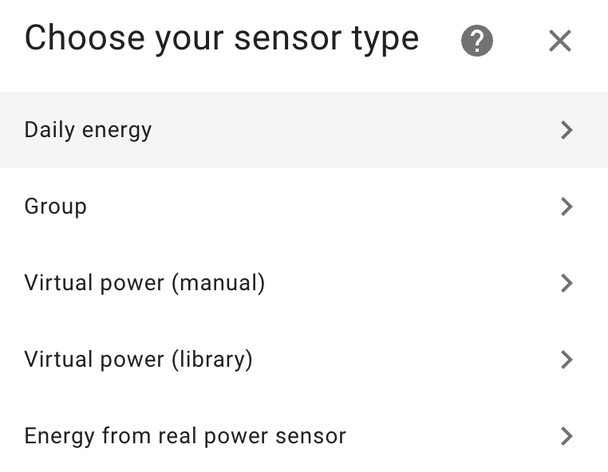

# Set up sensors

You can create new Powercalc sensor either with the GUI or YAML.

In the GUI just click the button to directly add a powercalc sensor:

When this is not working.

- Go to `Settings` -> `Devices & Services`
- Click `Add integration`
- Search and click `Powercalc`

After initializing the flow for a new configuration you'll be presented a list with choices:

We will explain the options briefly here. To get more information go to the respective sections in the documentation.

## [Virtual power (manual)](virtual-power-manual.md)

Create a virtual power sensor by manual configuration. This is the main feature of Powercalc and the possibilities are endless.

## [Virtual power (library)](virtual-power-library.md)

Create a virtual power sensor by selecting from the library of power profiles. See [supported models](https://library.powercalc.nl).

## [Group](group/index.md)

Make a group of different individual powercalc sensors. For example you can get the total usage of your kitchen this way or your full house usage. Also supports sub groups and more.

## [Daily fixed energy](daily-energy.md)

Use this for non smart devices which are not managed by HA, and which you known the daily kWh consumption of.
This allows you to create an energy sensor for that which you can add to the energy dashboard

## [Energy from real power sensor](real-power-sensor.md)

Use this when you have an existing power sensor in your installation, which you want to create energy sensor (and optionally utility meters) for.
This also makes it possible to add the power sensor to a powercalc [group](group/custom.md).

### Energy sensors and utility meters

When setting up power sensors using the above methods Powercalc can automatically create an [energy sensor](energy-sensor.md) (kWh) and optionally [utility meters](utility-meter.md) (sensors which cycle each hour, week, month).
The can be toggled in the GUI or use the YAML options `create_energy_sensor` and `create_utility_meters` globally or per sensor.
