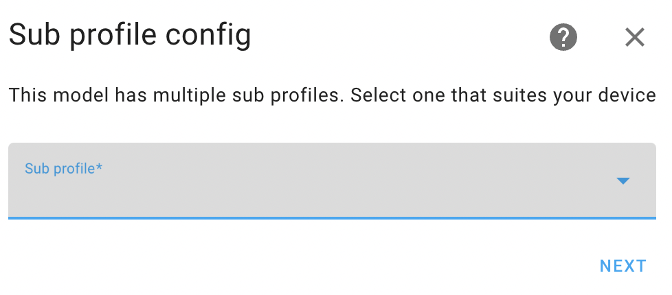

# Virtual power sensor (library)

Powercalc has a huge library of power profiles which can be directly used without the need of extensive configuration.
For all supported devices please see the [supported models](https://library.powercalc.nl) listing.

Most of the time Powercalc will find compatible devices in your system and provide you with a discovery flow which you only need to accept.

When your device is not found or you want to reuse or force a certain profile for another device you can select the profile manually.

Follow the instruction below depending on your preferred configuration method GUI or YAML.

## GUI

Just click the button to directly add a powercalc sensor:

[](https://my.home-assistant.io/redirect/config_flow_start/?domain=powercalc)

Select `Virtual power (library)` and follow the instructions.

To change the profile of an existing sensor, go to the sensor's settings and click on `Library options`.

## YAML

Just specify the correct manufacturer and model.

```yaml
powercalc:
  sensors:
    - entity_id: light.my_light
      manufacturer: signify
      model: LCT010
```

## Sub profiles

Some power profiles provide multiple sub profiles.

Examples of that are:

- Led strips of multiple lengths
- Lights with a night vision / infrared mode
- Lights which have a separate up and down light
- Camera's with a night vision

Most power profiles can automatically switch to the correct sub profile depending on some entity and/or attribute state, but for some of them Powercalc can not known and you must select on manually.
This applies for example to extensible led strips of different lengths.

In the GUI flow this will be asked in the wizard as shown in screenshot below.



In YAML you'll need to append the sub profile to the model, separated by a slash:
For example to select sub profile `length_9` of LIFX Z model.

```yaml
powercalc:
  sensors:
    - entity_id: light.my_light
      manufacturer: lifx
      model: LIFX Z/length_9
```

Powercalc also provides an action [`powercalc.switch_sub_profile`](../actions/switch-sub-profile.md) which you can call to switch to another sub profile while HA is running.
