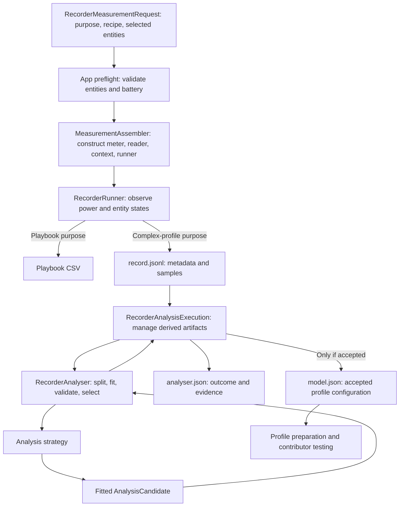

# Recorder and analyser architecture

Developer reference for the Measure app, including experimental vacuum analysis.
The flow has three stages: collect observations, fit and validate a model, and prepare
profile artifacts.

## 1. The complete flow

Recording reads Home Assistant states and measured power. Analysis runs offline on saved
observations; the result and preparation screens consume its artifacts.

## 2. Similar words that mean different things

| Term | Meaning and owner |
| --- | --- |
| Measurement mode | How measurements are obtained: recorder, controlled light measurements, charging, average, etc. |
| Recorder purpose | `playbook` or `complex_profile`; determines the artifact and whether automatic analysis runs. |
| Recorder recipe | `generic` or `vacuum_robot`; selects entity requirements and the applicable offline model family/validation policy. |
| Analysis strategy | A model-fitting algorithm in `measure/analyser/`. Builds a fitted candidate from training samples. |
| Candidate / fitted model | A Python object containing learned parameters and rules; predicts sample power and exports a config fragment. |
| Composite profile | An output model configuration containing ordered conditional branches. |
| Activity / episode | A semantic vacuum/dock activity and a run of observations belonging to it. Used for fitting and independent validation. |
| Profile metadata | Product, contributor, and measurement information accompanying the configuration. |

Strategies such as `FixedStatesPowerStrategy` and `VacuumCompositeStrategy` create candidates
containing learned parameters, prediction logic, and configuration export.

## 3. Configuration, assembly, and preflight

[request.py](measure/request.py) defines `RecorderMeasurementRequest`: purpose, recipe, and
selected IDs. For vacuums, the first two IDs identify the primary vacuum and required
battery; additional IDs are optional tracked entities.

The [registry](measure/ha_app/registry.py) defines wizard fields. The frontend defaults to
available same-device entities and supports changing the selection or adding dock entities.

[preflight.py](measure/ha_app/preflight.py) checks entity availability and verifies that the
vacuum battery is a numeric percentage sensor on the same device.

[assembler.py](measure/assembler.py) constructs the concrete power meter, `MeasureUtil`,
batched state reader, `AnalysisContext`, and runner. A registry snapshot supplies identity
metadata for portable profile references.

## 4. Recorder: collecting observations

[RecorderRunner](measure/runner/recorder.py) samples power and selected entity states at a
nominal two-second interval. Reads are sequential, so latency contributes to elapsed time
and alignment around transitions. `EntityStateReader` batches the selected IDs and returns
`RecorderEntityState` objects.

The runner streams either:

- Playbook CSV: headerless elapsed-seconds/power pairs.
- Complex JSONL: a metadata header, then elapsed time, measured watts, and entity maps.

Missing optional vacuum entities become `unavailable`, with one warning per entity.
Failed reads or missing required entities skip the sample. Stopping completes the run;
`RunnerResult` contains sample counts, duration, and voltages.

[recorder_capture.py](measure/recorder_capture.py) retains bounded scalar vacuum attributes
and filters known identifiers/secrets, URLs, and nested payloads. Generic recordings retain
full attributes. Review entity IDs and values before sharing.

## 5. Data models and artifacts

The analysis types are defined in [models.py](measure/analyser/models.py).

| Type | Responsibility |
| --- | --- |
| `RecordedEntity` | Captured identity: ID, domain, role, device ID, translation key, device class, unit, disabled/live-state information. |
| `AnalysisContext` | Recipe, primary ID, device type, selected metadata, and same-device inventory. |
| `RecordedEntityState` | One recorded state plus attributes. |
| `RecordingSample` | Elapsed seconds, measured watts, entity map, and source `recording_id`. |
| `RecordingDataset` / `LoadedRecording` | Parsed sample collection, metadata, and invalid-line warnings. |
| `AnalysisSplit` | Training samples, held-out validation samples, and the split method. |
| `FeatureReference` | A selected entity's state or one scalar attribute; knows how to read a sample. |
| `AnalysisMetrics` | Validation count, coverage, MAE, RMSE, and observed power range. |
| `ActivityReport` / `EnergyMetrics` | Per-activity validation evidence and measured/predicted energy. |
| `EvaluatedCandidate` | A fitted candidate together with its metrics and activity reports. |
| `ModelConfigFragment` | Exportable strategy-specific configuration. |
| `RecorderAnalysisResult` | Accepted candidate/config or actionable insufficient-data reason, plus validation evidence. |

[recording.py](measure/analyser/recording.py) accepts current typed JSONL and older samples
without `record_type`. Malformed samples are skipped with warnings; valid elapsed times and
power must be finite. Samples are immutable and retain all recorded entities.

`recording_context()` enriches the request's selected entities with captured registry
metadata, preserving recipe, primary selection, and roles for offline reanalysis.

`load_recordings()` combines compatible files and assigns source IDs. Currently, typed
headers must agree on recipe, primary entity, and selected entity metadata. The Python API
accepts multiple paths; the app's session flow passes one file.

Artifacts have different lifetimes:

- `record.jsonl`: retained source observations and metadata.
- `analyser.json`: replaceable outcome, selected inputs, validation evidence, or an
  insufficient-data reason. Replaces the former `analysis.json` filename.
- `model.json`: accepted generated configuration with measurement provenance.

The recording's `format_version` and report's `schema_version` version separate contracts.
Candidates export their parameters and rules as JSON configuration.

## 6. Analyser: orchestration and acceptance policy

[RecorderAnalyser](measure/analyser/service.py) owns this sequence:

1. Load source observations and recover captured metadata.
2. Choose the recipe's training/validation split.
3. Ask applicable strategies to build candidates from **training** samples.
4. Predict held-out samples and calculate errors/coverage.
5. Compare against a constant-power baseline and enforce support/credibility requirements.
6. Select an accepted candidate and request its export fragment.

Generic requests use the fixed fitter; vacuum requests use the vacuum fitter and
episode-based validation. `RecorderAnalysisExecution` persists results and updates summaries.

`ProfileAnalysisStrategy.build_candidate(samples, context)` returns an `AnalysisCandidate`
or `StrategyNotApplicable(reason)`. The strategy owns feature discovery, fitting, and
applicability checks.

The candidate exposes:

- `features`: all model inputs; `feature` remains a deterministic anchor for legacy reports
  and selection tie-breaking.
- `estimate_power(sample)`: fitted prediction, or `None` for an uncovered sample.
- `support_key(sample)`: the fitted category/activity whose observations count as support.
- `complexity`: a simple parameter-count proxy for model selection.
- `standby_power`: an explicitly measured standby value where available.
- `build_model_config_fragment()`: export of the fitted rules/parameters as profile configuration.

Prediction and export must agree on missing values, integer conversion, branch precedence,
and range guards.

Common acceptance thresholds currently require 90% validation coverage, at least five
covered samples per model value/activity, at least 0.1 W prediction range, and a reduction
in baseline MAE of at least 0.1 W **or** 15%. The baseline predicts the median training power.
When several model families are accepted, a more complex candidate needs at least 0.1 W
**and** 15% improvement over the simpler one. These thresholds are engineering heuristics.

## 7. Fixed fitter: one categorical input

[FixedStatesPowerStrategy](measure/analyser/fixed.py) examines the primary entity's state
and scalar attributes. It supports 2–20 distinct usable values with at least four training
samples each. Each value gets the median observed training power, rounded to two decimals.
It chooses its best feature by training MAE; the analyser then validates that candidate.
Generic validation preserves the existing deterministic every-fifth-sample holdout.

An `on`/`off` lookup table can export `fixed_config.power` with explicit standby; other
models export `states_power`. Attribute keys use the form `attribute|value`.

## 8. Vacuum fitter: known semantics, learned parameters

[vacuum_signals.py](measure/analyser/vacuum_signals.py) recognises runtime activities:
auto-emptying, station cleaning, washing, drying, charging, sleeping, charging completed,
docked, and operation away from the dock. Aliases normalise integration-specific labels.
`Activity` is the shared string enum for signals, branches and episodes;
`ACTIVITY_PRIORITY` defines their matching order. Recording labels and JSON reports use strings.

Signal priority is recognised runtime action entities, then primary activity flags.
Remaining activities use one enum source: related `state`, related `status`, primary
`vacuum_state`, primary `status`, or the HA state, in that order. Auxiliary station,
charging and sleeping signals fill specific gaps. Unknown inputs remain uncovered.

| Source | Recognised signals |
| --- | --- |
| Standard HA vacuum | Cleaning, returning, idle and paused as away; docked as docked. |
| Dreame | Detailed state/status aliases, auto-empty status, wash-base status, charging status and sleeping. |
| Roborock | Detailed status aliases for cleaning/mapping/returning, mop washing, bin emptying and charging/completion. |
| Ecovacs | Primary HA activity plus `station_state` for dustbin emptying, mop washing and drying. Legacy battery-charging binary sensors are supported. |

Station idle leaves the primary activity in control. `docked` alone does not identify
charging or completion. Errors and unrecognised modes require better runtime signals.

Portable related references require recorded same-device metadata and uniqueness across
the captured device inventory, including disabled duplicates. The exporter uses
`[[entity]]`, `[[entity_by_translation_key:…]]`, or an unambiguous battery device-class
placeholder. Separate-device dock references are deferred beyond the MVP.

[VacuumCompositeStrategy](measure/analyser/vacuum.py) groups training observations by the
first matching activity in dock-priority order. Non-charging activities get a median fixed
**total wall-outlet power**. Charging gets a bounded piecewise-linear battery calibration:

- Prefer the selected portable battery sensor; legacy recordings may use a matching
  primary `battery_level` attribute instead.
- Group integer battery percentages into five-percentage-point bins.
- Retain bins with at least three training observations and fit median levels/powers.
- Require at least three supported bins, 20 percentage points of span, and no gap over
  20 percentage points. Predictions are bounded to the fitted range.

`VacuumBranch` stores either fixed power or `ChargingPoint` values with named battery-level
and power fields. `ActivitySignal` stores its
feature and observed active/inactive values, and builds equivalent configuration conditions.
Boolean attributes use identity comparisons to distinguish booleans from numeric enums.

Export uses `stop_at_first`: guards enforce activity priority, including overlapping or
unknown inputs. Mutually exclusive values of the same enum share fewer guards. Charging
uses an explicit battery source and numeric/range guards matching candidate conversions.

Branches model total outlet power, including overlapping consumption. Per-activity validation
checks repeatability and requests better signals or isolated runs when errors are too large.

## 9. Independent evidence and diagnostics

Recorded states determine activity labels. Each identified activity needs two episodes with
at least five samples each. Episodes change at activity or recording boundaries. Short and
unexplained episodes remain in validation.

When compatible source files contain all activities on both sides, the last recording is
held out in full. Otherwise, alternate qualifying episodes of each activity are held out.
Training and validation use separate episodes, providing a check on repeated-cycle behaviour.

[vacuum_validation.py](measure/analyser/vacuum_validation.py) reports each activity's sample
and episode counts, coverage, MAE, transition MAE, and energy. Each activity must have 90%
coverage and MAE no greater than the larger of 0.5 W and 20% of its mean validation power.
Unexplained activities prevent acceptance. These checks keep long low-power periods from
masking a poor short, high-power dock cycle.

MAE is average absolute prediction error in watts. RMSE gives larger errors more weight.
Transition MAE covers the first/last observations of episodes. Per-activity results help
interpret overall error.

Energy uses trapezoidal integration between adjacent covered validation samples of the
same activity and recording, only for positive gaps up to 30 seconds. Reports include the
actual integrated duration, measured/predicted Wh, and signed energy bias. Integration stops
at uncovered samples, larger gaps, or activity boundaries. Energy and transition errors
provide supplementary diagnostics.

## 10. Execution, reanalysis, and profile preparation

[MeasurementExecution](measure/execution.py) calls analysis after a complex recording stops.
[RecorderAnalysisExecution](measure/analyser/execution.py) writes `analyser.json` atomically,
uses [write_model_json](measure/model.py) to add measurement provenance to accepted fragments,
and merges an analysis summary into the original sample-count/duration summary.

Reanalysis replaces derived artifacts while retaining observations and existing voltage
ranges. Insufficient evidence or failure removes a stale generated `model.json`.

`POST /sessions/{session_id}/analyse` asks the coordinator to reanalyse a retained, inactive
complex recording. The result view shows the outcome and model inputs; its JSON inspector
exposes the diagnostic artifact.

Product metadata editing/preparation in [profile/](measure/profile/) and
[contribution/](measure/contribution/) uses `ProfileMetadata` for editable product and
contributor details. Preparation validates the complete profile before contributor testing
and explicit submission.

## 11. Extension points and tests

Add a new offline model family by implementing `ProfileAnalysisStrategy` and an
`AnalysisCandidate`, registering applicability, and defining suitable validation before
enabling export.

A new exported representation must validate against
[model_schema.json](../../profile_library/model_schema.json) and preserve the fitted rules.
Keep recipe-specific semantics bounded. Vacuum aliases/signals belong in the signal module,
fitting changes in the model module,
and acceptance policy changes in the analyser/validation layer.

Relevant tests:

- [Generic analyser regressions](tests/analyser/test_recorder_analyser.py): preserve existing
  single-feature fitting and selection behaviour.
- [Vacuum analyser tests](tests/analyser/test_vacuum_analyser.py): portable metadata, activity
  precedence, charging support/range guards, held-out episodes/recordings, missing signals,
  short-mode errors, energy gaps, and insufficient-data outcomes.
- Recorder, execution, coordinator/API, and frontend tests: acquisition contracts, optional
  failures, safe artifact replacement, reanalysis, and result presentation.

Run utility checks from `utils/measure/`. Keep source-format compatibility, artifact semantics,
and prediction/export equivalence explicit when changing acquisition, fitting, or export.
