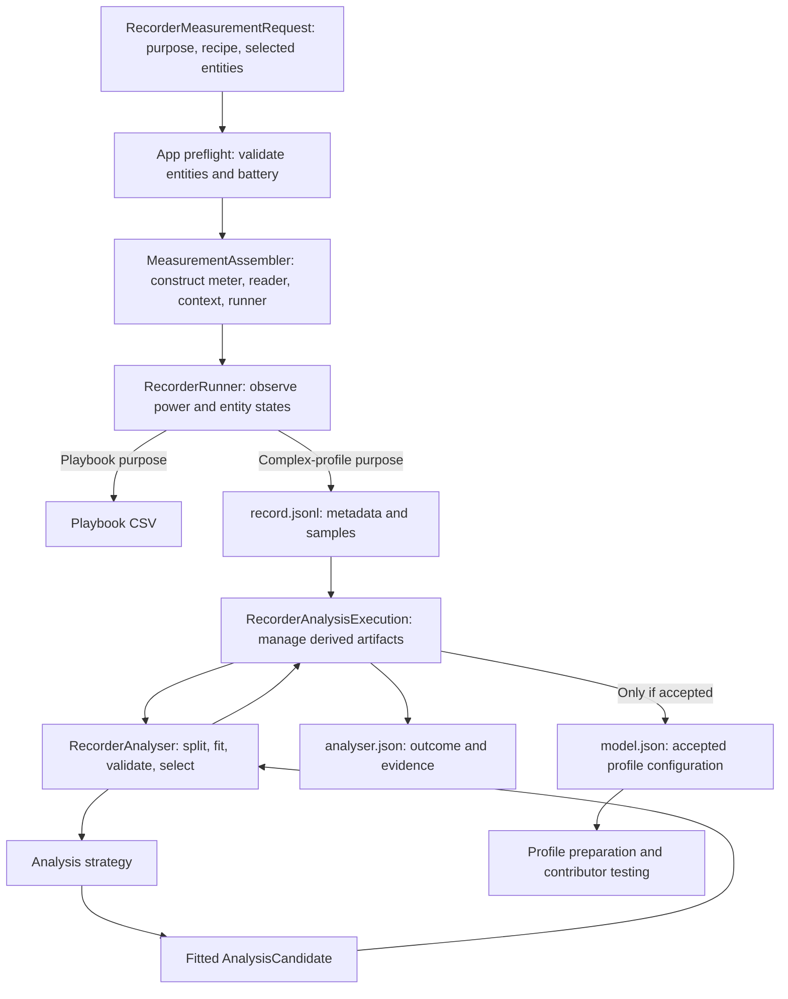

# Recorder and analyser architecture

Developer reference for the Measure app, including experimental vacuum analysis.
The flow has three stages: collect observations, fit and validate a model, and prepare
profile artifacts.

## 1. The complete flow

```mermaid
flowchart TD
    Request[RecorderMeasurementRequest: purpose, recipe, selected entities]
    Preflight[App preflight: validate entities and battery]
    Assembly[MeasurementAssembler: construct meter, reader, context, runner]
    Runner[RecorderRunner: observe power and entity states]
    CSV[Playbook CSV]
    JSONL[record.jsonl: metadata and samples]
    Execution[RecorderAnalysisExecution: manage derived artifacts]
    Analyser[RecorderAnalyser: split, fit, validate, select]
    Strategy[Analysis strategy]
    Candidate[Fitted AnalysisCandidate]
    Report[analyser.json: outcome and evidence]
    Model[model.json: accepted profile configuration]
    Preparation[Profile preparation and contributor testing]
    Request --> Preflight --> Assembly --> Runner
    Runner -->|Playbook purpose| CSV
    Runner -->|Complex-profile purpose| JSONL
    JSONL --> Execution --> Analyser
    Analyser --> Strategy --> Candidate --> Analyser
    Analyser --> Execution
    Execution --> Report
    Execution -->|Only if accepted| Model
    Model --> Preparation
```

Recording reads Home Assistant states and measured power. Analysis runs offline on saved
observations; the result and preparation screens consume its artifacts.

## 2. Similar words that mean different things

| Term | Meaning and owner |
| --- | --- |
| Measurement mode | How measurements are obtained: recorder, controlled light measurements, charging, average, etc. |
| Recorder purpose | `playbook` or `complex_profile`; determines the artifact and whether automatic analysis runs. |
| Recorder recipe | `generic` or `vacuum_robot`; selects entity requirements and the applicable offline model family/validation policy. |
| Analysis strategy | A model-fitting algorithm in `measure/analyser/`. Builds fitted candidates from training samples. |
| Candidate / fitted model | A Python object containing learned parameters and rules; predicts sample power and exports a config fragment. |
| Composite profile | An output model configuration containing ordered conditional branches. |
| Activity / episode | A semantic vacuum/dock activity and a run of observations belonging to it. Used for fitting and independent validation. |
| Profile metadata | Product, contributor, and measurement information accompanying the configuration. |

Strategies such as `FixedStatesPowerStrategy` and `VacuumCompositeStrategy` create candidates
containing learned parameters, prediction logic, and configuration export.

## 3. Configuration, assembly, and preflight

[request.py](measure/request.py) defines `RecorderMeasurementRequest`: purpose, recipe, and
selected IDs. For vacuums, the first two IDs identify the primary vacuum and required
battery; additional IDs are optional tracked entities.

The [registry](measure/ha_app/registry.py) defines wizard fields. The frontend defaults to
available same-device entities and supports changing the selection or adding dock entities.

[preflight.py](measure/ha_app/preflight.py) checks entity availability and verifies that the
vacuum battery is a numeric percentage sensor on the same device.

[assembler.py](measure/assembler.py) constructs the concrete power meter, `PowerSampler`,
batched state reader, `RecordingContext`, and runner. A registry snapshot supplies identity
metadata for portable profile references.

## 4. Recorder: collecting observations

[RecorderRunner](measure/runner/recorder.py) samples power and selected entity states at a
nominal two-second interval. Reads are sequential, so latency contributes to elapsed time
and alignment around transitions. `EntityStateReader` batches the selected IDs and returns
`RecorderEntityState` objects. `CapturedEntities` pairs filtered recording data with the
state-only values shown in the live session.

The runner streams either:

- Playbook CSV: headerless elapsed-seconds/power pairs.
- Complex JSONL: a metadata header, then elapsed time, measured watts, and entity maps.

Missing optional vacuum entities become `unavailable`, with one warning per entity.
Failed reads or missing required entities skip the sample. Stopping completes the run;
`RunnerResult` contains sample counts, duration, and voltages.

[recording/capture.py](measure/recording/capture.py) retains bounded scalar vacuum attributes
and filters known identifiers/secrets, URLs, and nested payloads. Generic recordings retain
full attributes. Review entity IDs and values before sharing.

## 5. Data models and artifacts

Observation types live in [recording/models.py](measure/recording/models.py); fitting and
validation types live in [analyser/models.py](measure/analyser/models.py).

| Type | Responsibility |
| --- | --- |
| `RecordedEntity` | Captured identity: ID, domain, role, device ID, translation key, device class, unit, disabled/live-state information. |
| `EntityRole` | Named primary, battery, tracked, available, and disabled roles; serialized as strings. |
| `RecorderProfileRecipe` / `RecordingContext` | Typed recipe, primary ID, device type, selected metadata, and same-device inventory. |
| `RecordingMetadata` | Parsed header with selected entities, device inventory, and related device IDs. |
| `RecordedEntityState` | One recorded state plus attributes. |
| `RecordingSample` | Elapsed seconds, measured watts, entity map, and source `recording_id`. |
| `RecordingDataset` / `LoadedRecording` | Parsed sample collection, metadata, and invalid-line warnings. |
| `TrainingValidationSplit` | Training samples, held-out validation samples, and the split method. |
| `ValidationMethod` | Held-out recording or held-out activity episodes. |
| `FeatureReference` | A selected entity's state or one scalar attribute; knows how to read a sample. |
| `AnalysisMetrics` | Validation count, coverage, MAE, RMSE, and observed power range. |
| `ActivityReport` / `EnergyMetrics` | Per-activity validation evidence and measured/predicted energy. |
| `EvaluatedCandidate` / `AnalysisFailure` | A validated candidate or its rejection reason, together with the corresponding activity reports. |
| `ModelConfigFragment` | Exportable strategy-specific configuration. |
| `RecorderAnalysisResult` | Accepted candidate/config or actionable insufficient-data reason, plus validation evidence. |

[recording.py](measure/analyser/recording.py) accepts current typed JSONL and older samples
without `record_type`. Malformed samples are skipped with warnings; valid elapsed times and
power must be finite. Samples are immutable and retain all recorded entities. Headers are
parsed once into `RecordingMetadata`; missing fields are tolerated and unknown recipe names
remain available for compatibility checks. Active contexts retain `RecorderProfileRecipe`,
which is defined with the recording models and re-exported from `request.py`.

`restore_recording_context()` enriches the request's selected entities with captured registry
metadata, preserving recipe, primary selection, and roles for offline reanalysis.

`load_recordings()` reads compatible files sequentially and assigns source IDs during parsing. Currently, typed
headers must agree on recipe, primary entity, and selected entity metadata, apart from
live availability and disabled status, which can change between runs.

The app's **Record more** action reuses a retained complex-profile session's settings.
After preflight, the coordinator archives `record.jsonl` as `record-1.jsonl` (then
`record-2.jsonl`, etc.) and starts another run in the same session. Each file retains its
own elapsed-time origin. Automatic analysis and **Analyse recording again** combine the
numbered runs and the latest `record.jsonl`. Archived runs remain analysable if the app
stops before the next file is created. The result lists total recordings and samples
analysed alongside the latest run's measurement summary. Each run has its own result plot.
Raw recordings remain downloadable session evidence and are excluded from prepared profiles.

Artifacts have different lifetimes:

- `record.jsonl`: retained source observations and metadata.
- `analyser.json`: replaceable outcome, selected inputs, validation evidence, or an
  insufficient-data reason. Replaces the former `analysis.json` filename.
- `model.json`: accepted generated configuration with measurement provenance.

The recording's `format_version` and report's `schema_version` version separate contracts.
Candidates export their parameters and rules as JSON configuration.

## 6. Analyser: orchestration and acceptance policy

[RecorderAnalyser](measure/analyser/service.py) owns this sequence:

1. Load source observations and recover captured metadata.
2. Choose the recipe's training/validation split.
3. Ask applicable strategies to build candidates from **training** samples.
4. Predict held-out samples and calculate errors/coverage.
5. Enforce generic baseline/support requirements or vacuum activity-level credibility checks.
6. Select an accepted candidate and request its export fragment.

Generic requests use the fixed fitter; vacuum requests use the vacuum fitter and
episode-based validation. `RecorderAnalysisExecution` persists results and updates summaries.

`ProfileAnalysisStrategy.build_candidates(samples, context, signals, recording_samples=...)`
returns a list of fitted candidates or `StrategyNotApplicable(reason)`. The strategy owns
feature discovery, fitting, and applicability checks. The full recording preserves interval
boundaries when fitting a training subset; discovered signals preserve the vocabulary used
to split vacuum episodes.

The candidate exposes:

- `features`: all model inputs; `feature` remains a deterministic anchor for legacy reports
  and selection tie-breaking.
- `estimate_power(sample)`: fitted prediction, or `None` for an uncovered sample.
- `get_support_key(sample)`: the fitted category/activity whose observations count as support.
- `complexity`: a simple parameter-count proxy for model selection.
- `standby_power`: an explicitly measured standby value where available.
- `build_model_config_fragment()`: export of the fitted rules/parameters as profile configuration.

Prediction and export must agree on missing values, integer conversion, branch precedence,
and range guards.

Generic acceptance thresholds require 90% validation coverage, at least five
training and five validation samples per model value, at least 0.1 W prediction range, and a reduction
in baseline MAE of at least 0.1 W **or** 15%. The baseline predicts the median training power.
Each value's validation MAE must be within the larger of 0.5 W or 20% of its measured mean power.
When several model families are accepted, a more complex candidate needs at least 0.1 W
**and** 15% improvement over the simpler one. These thresholds are engineering heuristics.

## 7. Fixed fitter: one categorical input

[FixedStatesPowerStrategy](measure/analyser/fixed.py) examines the primary entity's state
and scalar attributes, plus states of selected secondary entities with portable references.
It supports 2–20 distinct usable values with at least five training
samples each. Each value gets the median observed training power, rounded to two decimals.
Every fitted feature goes through validation before selection. A sparse attribute cannot
discard a credible state model merely because it has a lower training error on fewer samples.
Generic validation holds out the latest recording in full and trains on all earlier recordings.
Single recordings remain insufficient regardless of sample count. Every learned value must appear
in the held-out recording, so common states cannot hide an untested rare state.

An `on`/`off` lookup table can export `fixed_config.power` with explicit standby; other
models export `states_power`. Attribute keys use the form `attribute|value`.
Secondary states export a `stop_at_first` composite with portable state conditions. Each branch
models total outlet power, including when the primary entity is off. Missing or ambiguous references
exclude the secondary feature; secondary attributes and combinations of features are not fitted.

The generic request explicitly stores `primary_entity_id` and `profile_device_type`; `tracked_entity_ids`
contains only additional signals. Legacy requests promote their first tracked entity to primary.
The standalone device-type enum mirrors the profile schema and is checked for parity in tests.

## 8. Vacuum fitter: known semantics, learned parameters

[signals.py](measure/analyser/vacuum/signals.py) recognises runtime activities:
auto-emptying, station cleaning, washing, drying, charging, sleeping, charging completed,
docked, and operation away from the dock. Aliases normalise integration-specific labels.
When a recognised live charging flag records both states during drying, drying while
charging and drying after charging finishes become separate activities. Each learns
total outlet power independently; consumption is not decomposed or added together.
`Activity`, defined in the analyser models, is the shared string enum for signals, branches,
episodes and reports; `ACTIVITY_PRIORITY` defines their matching order. Unidentified activity
is represented internally by `None`, exported as `"unexplained"`. Recording labels and JSON
reports continue to use strings.

Signal priority is recognised runtime action entities, then primary activity flags.
Remaining activities use one enum source: related `state`, related `status`, primary
`vacuum_state`, primary `status`, or the HA state, in that order. Auxiliary station,
charging and sleeping signals fill specific gaps. Unknown inputs remain uncovered.

| Source | Recognised signals |
| --- | --- |
| Standard HA vacuum | Cleaning, returning, idle and paused as away; docked as docked. |
| Dreame | Detailed state/status aliases, auto-empty status, wash-base status, charging status and sleeping. |
| Roborock | Detailed status aliases for cleaning/mapping/returning, mop washing, bin emptying and charging/completion. |
| Ecovacs | Primary HA activity plus `station_state` for dustbin emptying, mop washing and drying. Legacy battery-charging binary sensors are supported. |
| Valetudo (MQTT) | Dock status for emptying, drying and broad station cleaning. Pause and error remain unresolved; charging needs a separate explicit signal. |

Station idle leaves the primary activity in control. `docked` alone does not identify
charging or completion. Errors and unrecognised modes require better runtime signals.
Dreame/Mova paused and idle states use the primary vacuum's recorded boolean `docked`
attribute to distinguish docked idle from operation away from the dock. A recognised
live charging flag identifies charging during these ambiguous states. Explicit dock
activities, completion, sleep and errors retain their own semantics. Missing context
remains uncovered rather than assigning an away or zero-power fallback.

[entity_references.py](measure/analyser/entity_references.py) resolves portable references
using captured registry metadata and inventory, including disabled duplicates. The exporter
uses `[[entity]]`, `[[entity_by_translation_key:…]]`, or an unambiguous battery device-class
placeholder. Related dock entities are supported when no matching entity on the primary
device shadows them and exactly one match exists across related devices.
Rules can also provide a known semantic unique-ID suffix, exported as
`[[entity_by_unique_id_suffix:…]]`. This lookup requires one match on the primary
device and integration, including disabled duplicates when checking ambiguity.
Valetudo uses `_sensor_dock_status`; the recording preserves unique IDs and device
manufacturer so offline analysis can apply the same mapping after entity renaming.

[VacuumCompositeStrategy](measure/analyser/vacuum/strategy.py) groups training observations by the
first matching activity in dock-priority order. Non-charging activities get a time-weighted mean fixed
**total wall-outlet power**, preserving energy for cycling loads. Without consecutive usable
intervals, fitting falls back to the arithmetic mean. Charging gets a bounded piecewise-linear battery calibration:

- Prefer the selected portable battery sensor; legacy recordings may use a matching
  primary `battery_level` attribute instead.
- Group integer battery percentages into five-percentage-point bins.
- Retain bins with at least three training observations and fit median levels/powers.
- Require at least three supported bins, 20 percentage points of span, and no gap over
  20 percentage points. Predictions are bounded to the fitted range.

`VacuumBranch` is the union of `FixedBranch`, with a required fixed power, and
`ChargingBranch`, with required `ChargingPoint` values. A charging curve validates that it
has at least two points with strictly increasing battery levels before interpolation.
`ActivitySignal` stores its feature, observed active/inactive values, and any required
context signals, and builds equivalent configuration conditions. Context features are
included in the model inputs. Inactive guards preserve unknown source and context values.
Boolean attributes use identity comparisons to distinguish booleans from numeric enums.

Export uses `stop_at_first`: guards enforce activity priority, including overlapping or
unknown inputs. Mutually exclusive values of the same enum share fewer guards. Charging
uses an explicit battery source and numeric/range guards matching candidate conversions.

Branches model total outlet power, including overlapping consumption. Per-activity validation
checks repeatability and requests better signals or isolated runs when errors are too large.

## 9. Validation evidence and diagnostics

Recorded states determine activity labels. Episodes change at activity or recording boundaries.
Short episodes with fewer than five samples and unexplained episodes remain in validation.

When compatible source files contain all activities on both sides, the last recording is
held out in full if it covers at least 10% of every activity's eligible recorded time and
training can cover its charging range. Otherwise, alternate qualifying episodes of each
activity are held out where suitable. Activities with only one qualifying episode, or
less than 10% of their eligible recorded time held out by the episode split, use a
within-cycle split while other activities retain their independent validation. Charging
without sufficient independent range coverage also uses this fallback: the middle third
(at least two samples) is held out from each episode, separately within each
5-percentage-point battery bucket for charging. Bucket edges remain available for fitting.
All samples belong to only one side of the split. Existing minimum fitting support and
per-activity validation thresholds still apply.

The `held_out_blocks` method identifies this weaker evidence and includes a warning that
repeatability across cycles has not been tested for those activities. It allows a useful
profile from one complete cycle without claiming independent validation. An insufficient
charging curve with a battery rise hidden by drying requests one isolated charge with
drying off, which can be added to the existing session.

[validation.py](measure/analyser/vacuum/validation.py) reports each activity's sample
and episode counts, coverage, MAE, transition MAE, and energy. Each activity must have 90%
coverage. Fixed activities require consecutive readings and compare measured versus predicted
time-weighted average power; charging compares per-sample MAE. Both allow at most the larger
of 0.5 W and 20% of their measured average power. Vacuum acceptance uses these activity checks;
the overall MAE and constant-power baseline do not veto a repeatable cycling load.
Samples matching no activity are tolerated up to 10% of the recording, so a brief
unavailable blip or transient state does not reject it; beyond that acceptance fails.
These checks keep long low-power periods from masking a poor short, high-power dock cycle.
Failed sleeping, completed or docked energy validation explains that one reported state
may contain both post-charge settling and stable standby. One fixed power cannot always
represent both; repeating identical recordings may not solve this modelling limitation.
The analyser does not infer a time-since-charge model or silently discard settling energy.

MAE is average absolute prediction error in watts. RMSE gives larger errors more weight.
Transition MAE covers the first/last observations of episodes. Per-activity results help
interpret overall error.

Energy uses trapezoidal integration between adjacent covered validation samples of the
same activity and recording, only for positive gaps up to 30 seconds. Reports include the
actual integrated duration, measured/predicted Wh, and signed energy bias. Integration stops
at uncovered samples, larger gaps, or activity boundaries. Activity groups and predictions
are reused while building reports. Checks use full-precision metrics; rounding happens only
when serializing the report. Transition errors remain supplementary diagnostics.

## 10. Execution, reanalysis, and profile preparation

[MeasurementExecution](measure/execution.py) calls analysis after a complex recording stops.
[RecorderAnalysisExecution](measure/analyser/execution.py) writes `analyser.json` atomically,
uses [write_model_json](measure/profile/model_json.py) to add measurement provenance to accepted fragments,
and merges an analysis summary into the original sample-count/duration summary.

Reanalysis replaces derived artifacts while retaining observations and existing voltage
ranges. Insufficient evidence or failure removes a stale generated `model.json`.

`POST /sessions/{session_id}/analyse` asks the coordinator to reanalyse a retained, inactive
complex recording. The result view shows the outcome and model inputs; its JSON inspector
exposes the diagnostic artifact.

Product metadata editing/preparation in [profile/](measure/profile/) and
[contribution/](measure/contribution/) uses `ProfileMetadata` for editable product and
contributor details. Preparation validates the complete profile before contributor testing
and explicit submission.

## 11. Extension points and tests

Add a new offline model family by implementing `ProfileAnalysisStrategy` and an
`AnalysisCandidate`, registering applicability, and defining suitable validation before
enabling export.

A new exported representation must validate against
[model_schema.json](../../profile_library/model_schema.json) and preserve the fitted rules.
Keep recipe-specific semantics bounded. Vacuum aliases/signals belong in the signal module,
fitting changes in the model module,
and acceptance policy changes in the analyser/validation layer.

Relevant tests:

- [Generic analyser regressions](tests/analyser/test_recorder_analyser.py): preserve existing
  single-feature fitting and selection behaviour.
- [Vacuum analyser tests](tests/analyser/test_vacuum_analyser.py): portable metadata, activity
  precedence, charging support/range guards, held-out episodes/recordings, missing signals,
  short-mode errors, energy gaps, and insufficient-data outcomes.
- Recorder, execution, coordinator/API, and frontend tests: acquisition contracts, optional
  failures, safe artifact replacement, reanalysis, and result presentation.

Run utility checks from `utils/measure/`. Keep source-format compatibility, artifact semantics,
and prediction/export equivalence explicit when changing acquisition, fitting, or export.
